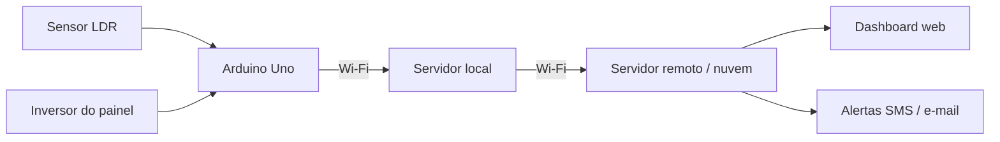

  

# ☀️ Cellara

**Sistema de Monitoramento de Painéis Fotovoltaicos com Sensor LDR e Arduino**

Monitoramento inteligente de desempenho solar em painéis fotovoltaicos por sensores de luminosidade.

## 📌 Sobre o projeto

A geração de energia em painéis fotovoltaicos é impactada por fatores como irradiância, temperatura e, principalmente, acúmulo de sujeira — que pode reduzir significativamente a potência gerada em relação à nominal. O problema não é a falta de tecnologia, mas a ausência de dados de referência sobre a incidência de luz que permitam identificar essas perdas a tempo.

O **Cellara** propõe um protótipo de baixo custo que utiliza um sensor LDR acoplado a um Arduino Uno para monitorar continuamente a luminosidade incidente sobre os painéis, comparando esses dados com a geração real registrada pelo inversor. A partir dessa comparação, o sistema evidencia desvios de desempenho associados a sombreamento, sujidade ou falhas técnicas, alertando o cliente sobre a necessidade de limpeza ou manutenção antes que a perda se torne significativa.

## 🎯 Objetivos

- Captar continuamente a luminosidade incidente sobre os painéis via sensor LDR e Arduino Uno;
- Relacionar os dados de luminosidade com a geração de energia registrada pelo inversor;
- Disponibilizar os resultados em uma aplicação web com dashboards;
- Emitir alertas, indicando a necessidade de intervenção, identificando o painel ou setor afetado.

## 🧩 Módulos previstos

- **Captura e processamento de dados** — leitura de luminosidade (lux) e captação de tensão/resistência do inversor;
- **Detecção de anomalias** — cruzamento das leituras dos sensores com a capacidade de produção esperada dos painéis;
- **Visualização e relatórios** — energia gerada vs. esperada, perdas acumuladas, histórico e comparação entre painéis;

## 🔄 Fluxo do sistema

## 🚧 Status do projeto

🚧 **Em desenvolvimento.** Este é um projeto acadêmico (São Paulo Tech School — Ciência da Computação, 2026), atualmente em fase de definição de escopo e arquitetura. Ainda não há funcionamento completo, testes ou guia de instalação — este README será atualizado conforme o projeto avançar.

## 👥 Equipe

Grupo 2 — São Paulo Tech School — Ciência da Computação

